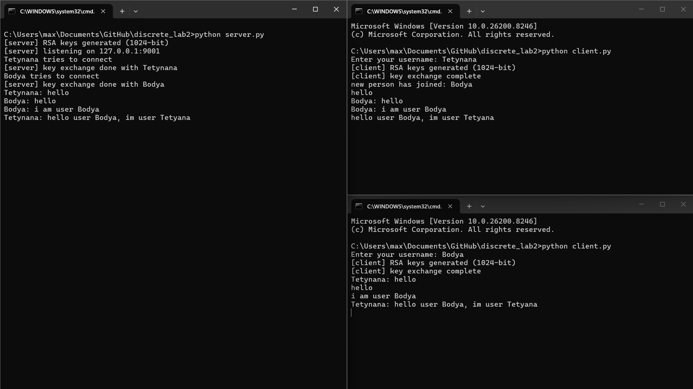

# LAB2: Чат з RSA

Термінальний чат, де всі повідомлення надійно шифруються за допомогою власноруч написаного алгоритму RSA, а їхня цілісність перевіряється через SHA 256 хеші.

## Приклад роботи чату


## Інструкції до запуску

1. Запускаємо сервер (він обробляє і пересилає повідомлення)
```bash
python server.py
```

2. Запускаємо клієнта (можна відкрити кілька окремих терміналів для різних користувачів)
```bash
python client.py
```
Після запуску треба буде придумати та ввести свій нікнейм. Далі все відбувається автоматично. Ваш клієнт і сервер створюють локальні 1024 бітні ключі RSA і обмінюються публічними ключами. Після цього можна спілкуватися.

## Коротке пояснення імплементації

### Як працює RSA

* Генерація простих чисел. Спершу ми генеруємо дуже великі випадкові непарні числа по 512 біт. Перевірка їх на простоту робиться за допомогою імовірнісного тесту Міллера Рабіна.
* Математика ключів. Спершу ми перемножуємо два великих простих числа p та q і отримуємо значення n яке називається модулем. Воно буде спільною частиною обох ключів. Далі рахуємо функцію Ейлера тобто добуток p мінус 1 на q мінус 1.
* Для публічного ключа обираємо стандартну експоненту e яка зазвичай дорівнює 65537 і гарантуємо через Алгоритм Евкліда що вона взаємно проста з функцією Ейлера.
* За допомогою Розширеного алгоритму Евкліда знаходимо модульне обернене значення d. Це спеціальне число таке що при множенні на e воно дає остачу 1 при діленні на функцію Ейлера.
* Таким чином у нас з'являються дві пари ключів. Публічний ключ це пара e та n. Її можна вільно передавати кому завгодно щоб вони могли шифрувати для вас свої повідомлення. Приватний ключ це пара d та n. Ви тримаєте цей ключ у секреті і користуєтесь ним лише для того щоб розшифровувати отримані тексти.
* Шифрування і розшифрування. Кожен символ переводиться в ціле число. Далі ми беремо це число підносимо його до степеня e і беремо остачу від ділення на n. Це і є шифрування. Для розшифрування зашифроване число підносимо до степеня d і беремо остачу від ділення на n. Отримуємо назад свій символ.

### Цілісність повідомлень та Цифровий Підпис
Щоб точно знати що повідомлення не перехопили і не змінили по дорозі була додана перевірка хешів через стандартну бібліотеку hashlib. А для того щоб підтвердити автора повідомлення реалізований Цифровий Підпис.

Коли ви відправляєте повідомлення відбувається наступне
1. Рахуємо SHA 256 хеш зі звичайного тексту.
2. Шифруємо цей хеш власним Приватним Ключем. Це називається створенням Цифрового Підпису бо тільки ми могли його зробити.
3. Шифруємо сам текст повідомлення Публічним Ключем отримувача щоб тільки він міг прочитати текст.
4. Створюємо JSON де зберігається зашифрований текст та наш цифровий підпис.
5. Співрозмовник отримує цей JSON і розшифровує текст своїм Приватним Ключем. Потім він бере наш цифровий підпис і розшифровує його використовуючи наш Публічний Ключ. Якщо після цього отриманий хеш збігається з хешем розшифрованого тексту то повідомлення дійсно не змінилося і відправили його саме ми.

### Обмін даними по мережі
Кожне зашифроване і запаковане JSON повідомлення просто розділяється символом нового рядка. Сервер і клієнти накопичують дані з сокета в буфер і читають інформацію рядок за рядком.
